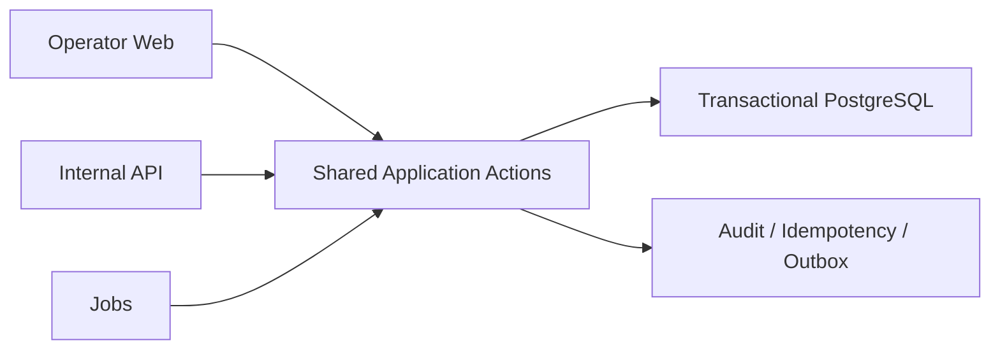

# BoatOps Project Charter

Status: `ACTIVE`

Charter version: `2.0`

Effective: `2026-08-10` (when merged to `main`)

## 1. Mission

> **BoatOps exists to give real vessel operators one safe, simple source of truth for whole-vessel availability, bookings, and trip execution.**

第一目标：让真实 Operator 每天安全、简单地管理整船库存、订单和出航。

第二目标：在不牺牲第一目标的前提下，保持 organization-scoped、可复用、可自托管，不硬编码 Ayany、船只、时段、价格或渠道规则。

永久优先级：

> **Safety / Operational Truth > Time-to-Real-Use > Feature Completeness**

## 2. Current product boundary

Authoritative inventory model:

`Organization + Boat + Occupied Interval`

Current scope:

- whole-vessel charter, yacht, speedboat, private excursion/tour;
- Availability, HOLD, Booking, BLOCK, Trip, Audit;
- organization-scoped operations.

Not currently promised:

- seat/ticket/shared-capacity inventory;
- seats remaining, cabins, or passenger allocation;
- generic local-activity capacity management.

This is a deliberate boundary, not a missing seat-inventory feature.

## 3. Primary surface and architecture

Primary product surface: **Operator Web**

```text
Booking:   Availability -> Inquiry -> HOLD -> Confirm -> Amend / Cancel
Trip:      Confirmed Booking -> Today's Trips -> Prepare -> Depart -> Return -> Complete
Inventory: BLOCK -> Release
Audit:     cross-cutting
```

Internal APIs, jobs, outbox, and events are secondary integration surfaces. Public API expansion requires a real consumer.



Web-first is a product priority, not a Web-owned business-rule path. Controllers remain thin authorization/validation/transport adapters.

Four product layers:

1. **Core Operational Truth** — Organization, Boat, Slot, Allocation, HOLD, Booking, BLOCK, Trip, Audit, Idempotency.
2. **Operator Web** — the daily work surface; Blade + small JS until real use proves otherwise.
3. **Integration Surface** — APIs/jobs/events; maintenance-first and contract-stable.
4. **Candidate Foundations** — Finance/Fuel/Expense/Stock/Cash/Reversal/Rate; `FOUNDATION / NOT_CURRENT_PRODUCT_PRIORITY`.

## 4. Permanent invariants

1. PostgreSQL becomes final inventory-conflict authority only after explicit cutover.
2. Final HOLD/Confirm/Amend/Cancel/release/expiry/BLOCK decisions are transactional and auditable.
3. Calendar and availability are projections; commands re-adjudicate authority.
4. Web/API/jobs use the same Application Actions.
5. Service time, buffers, and occupied interval are distinct facts.
6. **Booking or Trip completion must not end physical inventory authority before `occupied_end`.**
7. **A completed Booking retains its required same-service-date slot-compatibility effect.**
8. Trip/Booking lifecycle and inventory authority are related but not identical state machines.
9. Cross-organization data is neither visible nor mutable.
10. Demo and production data/runtime remain isolated.

A green test or earlier review does not override a newly proven invariant violation. Implementation details belong to a bounded CODE Gate, not this Charter.

## 5. Development model

```text
FIRST PRINCIPLES
-> MINIMUM IMPLEMENTATION PATH
-> VERTICAL SLICE
-> TIME TO REAL USE
-> FEEDBACK LOOP
-> SSOT
-> OBSERVABILITY
-> PROGRESSIVE COMPLEXITY
```

There is no preplanned WP4/WP5/WP6.

Every change must be the smallest observable, reversible vertical slice that protects a universal invariant or resolves demonstrated real-use pain.

Permanent rule:

```text
NO NEW FEATURE DEVELOPMENT
unless:
  - REAL_PILOT_BLOCKER
  - OBSERVED_OPERATIONAL_PAIN
  - UNIVERSAL_CORE_SAFETY_DEFECT
```

Routine progress uses the real-use feedback loop. It does not require a separate governance PR or traversal through historical Gates.

Issue classes:

- `core-safety` — incorrect operational truth;
- `real-use-blocker` — Operator cannot finish the workflow;
- `observed-pain` — repeated friction from real use;
- `future` — unproven idea, not scheduled by default.

## 6. Sources of truth and observability

| Fact | Authority |
| --- | --- |
| Mission, scope, invariants, safety checkpoints | this Charter |
| Current machine state | `.project/CURRENT_STATE.yaml` |
| Allowed/forbidden/next action | `.project/CURRENT_GATE.md` |
| Review blockers and evidence ledger | `.project/REVIEW_QUEUE.md` |
| Code and tests | exact Git SHA/diff and reproducible CI |
| Deployment | immutable manifest and receipt |
| Operations after cutover | production PostgreSQL |
| History | existing closure/release receipts and Git/PR history |

Before cutover, BoatOps must not be described as live operational authority. Chat or executor self-report is not proof.

Minimum Pilot observability must answer:

- who changed which object, when, and with what result;
- why inventory blocked/released and which revision resulted;
- idempotency replay/conflict and outbox failure status;
- deployed source/config identity;
- scheduler, health, backup/restore, and rollback status;
- where an Operator left BoatOps to finish work and why.

Reuse audit, idempotency, revision, outbox, constraints, health, and receipts before building analytics.

## 7. Progressive complexity and non-goals

Add only the smallest proven need:

- capacity field only for real vessel-limit risk;
- Product/Slot mapping only after repeated wrong combinations;
- Admin Web only when repeat provisioning is error-prone;
- Finance/CRM/reporting/maintenance only for a real blocker or repeated pain;
- API/ChannelHub/OTA only for a real consumer.

Current non-goals:

- SPA rewrite;
- ChannelHub/OTA/WordPress inventory integration;
- payment gateway/full accounting/CRM/reporting platform;
- broad Stock/Fuel UI, maintenance/documents, complex manifest;
- full-history automation, SaaS super-admin, second-company onboarding;
- public semantic-version Release.

## 8. Deployment boundaries

Organization, vessel ownership/rights, schedules, buffers, HOLD TTL, compatibility, pricing, weather, and Operator identity are reviewed deployment facts.

Future controlled provisioning should first use an idempotent reviewed manifest/one-time command with validation and rollback; a general Admin UI is not required until repeated deployment proves the need.

ChannelHub remains separate, never writes BoatOps tables, and cannot confirm from cache while BoatOps is unavailable. WordPress is not inventory authority. A spreadsheet may be an authorized migration/reconciliation source but cannot overrule BoatOps after cutover.

## 9. Safety checkpoints

These checkpoints are triggered only when the corresponding action occurs. They are not mandatory project phases before every implementation iteration.

1. **CODE / MERGE** — exact diff, invariants, tests, CI, independent review; never deploys.
2. **DEPLOYMENT** — exact source/config, PostgreSQL, secrets, scheduler, monitoring, backup/restore, rollback; never admits real data.
3. **REAL DATA / CUTOVER** — admitted scope, reconciliation, rollback, prior-system boundary, authority-switch moment; never creates a public Release.
4. **RELEASE** — license, version, Tag, GitHub Release, install/upgrade commitments.

`merge != deploy != cutover != release`

Passing tests or a Draft PR never advances another Gate.

Owner grants product and Gate authority. Reviewer classifies scope/evidence. Executor performs only the bounded task and never self-approves.

Secrets, cookies/browser storage, customer PII, real contracts/quotes/finance, and production backups are forbidden in public Git, reports, screenshots, and fixtures.

Stop on scope drift, failed safety, unexplained mutation, unreproducible evidence, or any false authorization in `CURRENT_STATE.yaml`.
