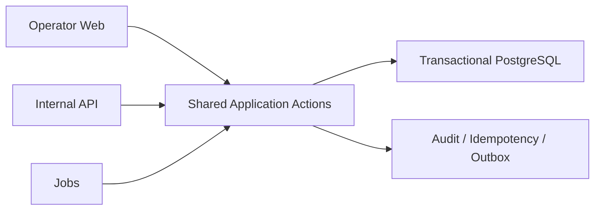

# BoatOps

**Whole-vessel inventory and operations for real vessel operators.**

> **Safety / Operational Truth > Time-to-Real-Use > Feature Completeness**

Primary surface: **Operator Web**

```text
Booking:   Availability -> Inquiry -> HOLD -> Confirm -> Amend / Cancel
Trip:      Confirmed Booking -> Today's Trips -> Prepare -> Depart -> Return -> Complete
Inventory: BLOCK -> Release
Audit:     cross-cutting
```

BoatOps is organization-scoped, reusable, and self-hostable, but platform breadth does not take priority over a safe real Operator workflow.

## What BoatOps does

- whole-vessel availability using occupied intervals;
- HOLD, Confirm, Amend, Cancel, BLOCK, and release;
- operational dossier and Booking workbench;
- Trip preparation and execution foundations;
- inventory revision, audit, idempotency, and outbox;
- organization isolation;
- internal contracts that reuse the same Application Actions as Operator Web.

Current inventory model:

`Organization + Boat + Occupied Interval`

BoatOps does not currently promise seat/ticket/shared-capacity inventory, CRM, payment/full accounting, analytics, maintenance, complex manifests, ChannelHub/OTA, full-history automation, SaaS administration, or public Release.

Finance/Fuel/Expense/Stock/Cash/Reversal/Rate code remains:

`FOUNDATION / NOT_CURRENT_PRODUCT_PRIORITY`

## Architecture



Web-first is a product priority, not a second business-rule path. Calendar/availability are projections; final commands re-adjudicate inventory. PostgreSQL becomes operational authority only after an explicit cutover.

## Current status

Do not infer current authorization from this README. Use the deliberately separated authorities:

- [Charter](.project/PROJECT_CHARTER.md)
- [machine-readable current state](.project/CURRENT_STATE.yaml)
- [allowed, forbidden, acceptance, and next decision](.project/CURRENT_GATE.md)
- [historical review ledger (HISTORICAL_ONLY, not an active queue)](.project/REVIEW_QUEUE.md)
- [Real Operations path](docs/product/REAL_OPERATIONS_PILOT_MVP.md)

## Development path

`CORE SAFETY -> DEPLOYMENT READINESS -> PILOT CUTOVER -> REAL USE -> OBSERVED PAIN -> NEXT MINIMUM CHANGE`

There is no WP4/WP5/WP6 feature queue. Work must be `core-safety`, `real-use-blocker`, or evidenced `observed-pain`; otherwise it remains `future`.

## Local development

CI uses PHP 8.4, Composer 2, Node.js 22, SQLite, and PostgreSQL concurrency validation.

From a new checkout with a reviewed local `.env`:

```bash
composer run setup
composer run dev
```

Checks:

```bash
composer test
vendor/bin/pint --test
npm run test:contract
npm run build
```

Do not point local commands at production or real data.

## History and boundaries

D1 was an isolated fictional Demo, not production or Release:

- [D1 closure](.project/D1_GOVERNANCE_CLOSURE.md)
- [D1 receipt](docs/releases/d1-g1-fictional-demo-deployment-receipt.md)
- [branch ledger](.project/BRANCH_LEDGER.md)
- [historical WP1-WP3 freeze](docs/product/REAL_OPERATIONS_PILOT_MVP_SCOPE_FREEZE.md)

BoatOps is not Ayany-specific. Vessel ownership, schedules, buffers, HOLD TTL, prices, compatibility, weather, and Operators are deployment facts. ChannelHub is separate and never writes BoatOps tables. WordPress is not inventory truth. Demo and production remain isolated.

Licensing, Tags, and GitHub Releases are governed by the separate RELEASE Gate. Never commit credentials, browser storage, PII, real contracts/quotes/finance, production backups, or real inventory. Fixtures must be synthetic.
